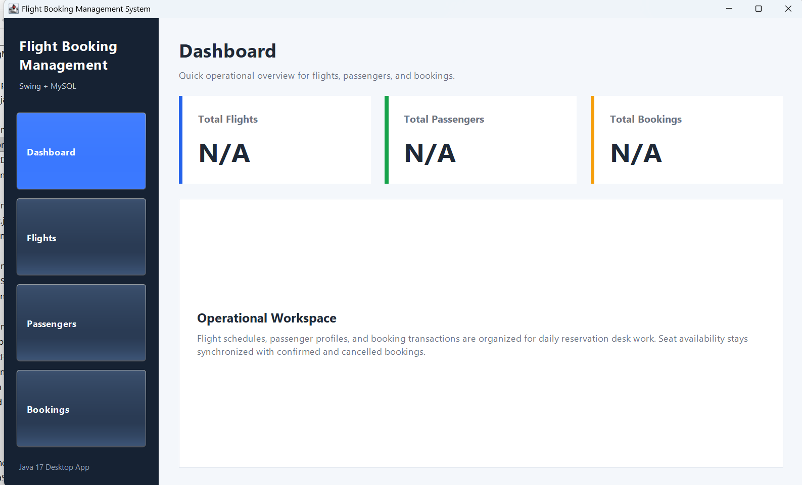
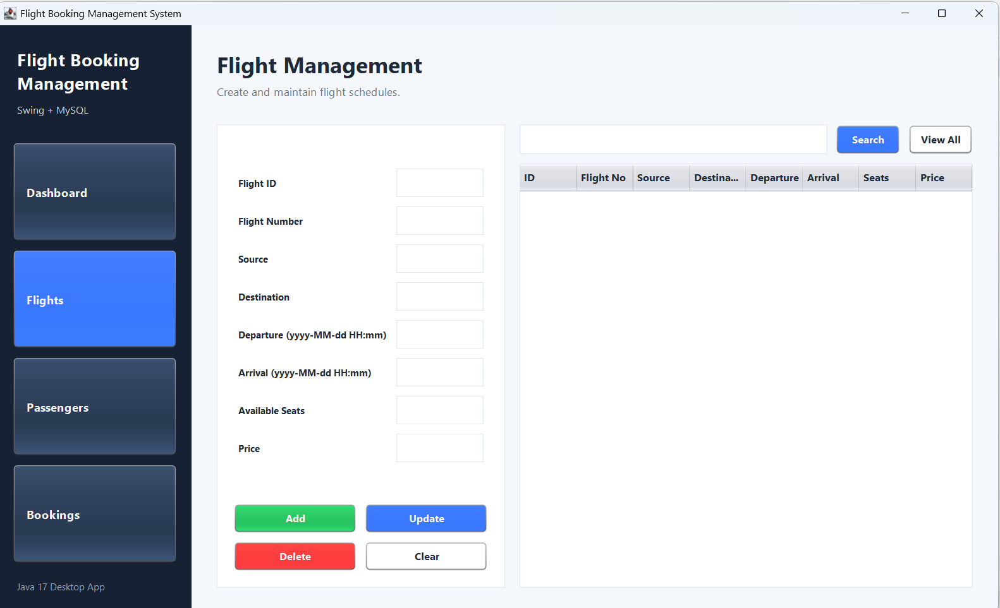
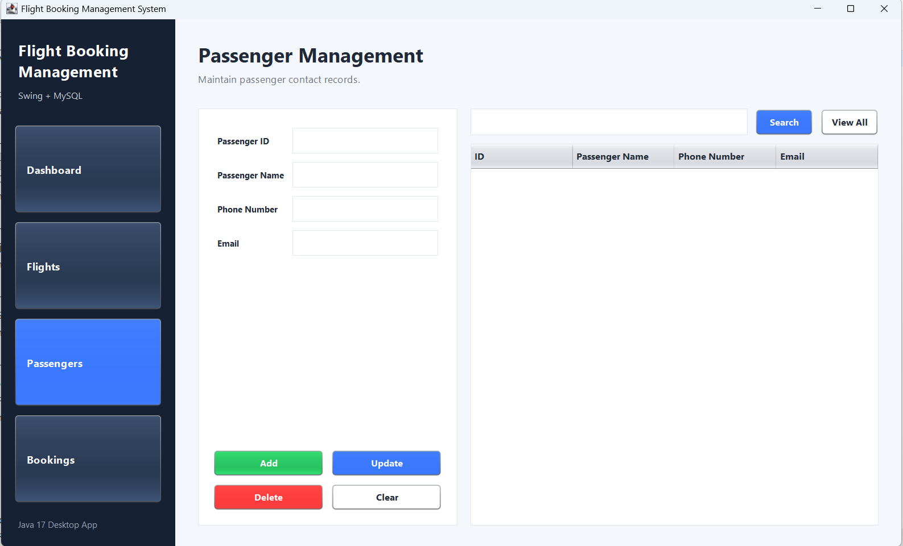
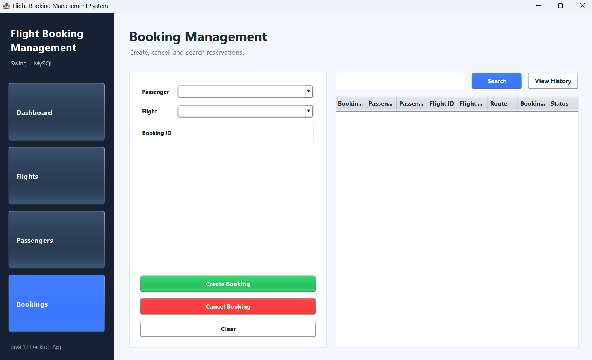

# ✈️ Flight Booking Management System

A professional desktop-based Flight Booking Management System developed using Java Swing, JDBC, and MySQL.

This application allows users to manage flights, passengers, and bookings through an intuitive graphical interface while storing data securely in a MySQL database.

---

## 🚀 Features

### Dashboard

* View total flights
* View total passengers
* View total bookings
* Quick operational overview

### Flight Management

* Add Flight
* Update Flight
* Delete Flight
* Search Flight
* View All Flights

### Passenger Management

* Add Passenger
* Update Passenger
* Delete Passenger
* Search Passenger
* View All Passengers

### Booking Management

* Create Booking
* Cancel Booking
* Search Booking
* View Booking History

### Additional Features

* Automatic seat decrease after booking
* Automatic seat increase after cancellation
* User-friendly validation
* JDBC database connectivity
* Layered architecture (DAO → Service → UI)

---

## 🛠️ Technologies Used

* Java 17
* Java Swing
* JDBC
* MySQL 8.0
* Eclipse IDE
* MVC / Layered Architecture

---

## 📂 Project Structure

```text
FlightBookingManagementSystem
│
├── src
│   ├── dao
│   ├── model
│   ├── service
│   ├── ui
│   └── Main.java
│
├── screenshots
│   ├── dashboard.png
│   ├── flights.png
│   ├── passengers.png
│   └── bookings.png
│
└── README.md
```

---

## 🏗️ Architecture

```text
Java Swing UI
       │
       ▼
Service Layer
       │
       ▼
DAO Layer
       │
       ▼
MySQL Database
```

---

## 📸 Screenshots

### Dashboard



---

### Flight Management



---

### Passenger Management



---

### Booking Management



---

## 🗄️ Database Setup

Create database:

```sql
CREATE DATABASE flight_booking_db;
USE flight_booking_db;
```

Required Tables:

* flights
* passengers
* bookings

Update database credentials in:

```text
src/dao/DBConnection.java
```

Example:

```java
private static final String URL =
"jdbc:mysql://localhost:3306/flight_booking_db";

private static final String USERNAME = "root";
private static final String PASSWORD = "your_password";
```

---

## ▶️ How to Run

1. Clone the repository
2. Open in Eclipse IDE
3. Add MySQL Connector/J to Build Path
4. Create MySQL database and tables
5. Configure DBConnection.java
6. Run Main.java

---

## 🎯 Learning Outcomes

This project demonstrates:

* Object-Oriented Programming (OOP)
* Java Swing GUI Development
* JDBC Database Connectivity
* CRUD Operations
* Layered Architecture
* MySQL Integration
* Exception Handling
* JTable Data Management

---

## 👨‍💻 Author

Parthiv Jogadiya

B.Tech Integrated Program in Artificial Intelligence

SVNIT Surat

---

## ⭐ Future Enhancements

* User Authentication
* Role-Based Access Control
* PDF Ticket Generation
* Flight Analytics Dashboard
* Email Notifications
* Advanced Search Filters
